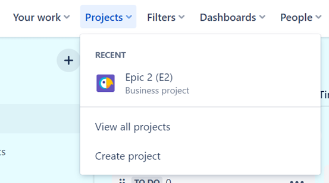
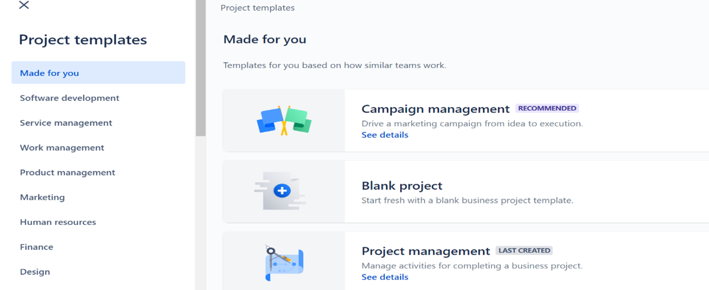
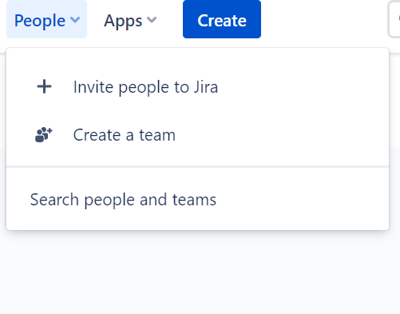
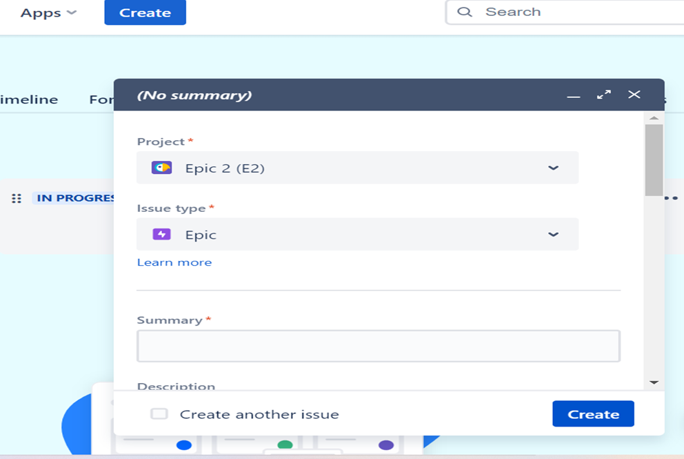
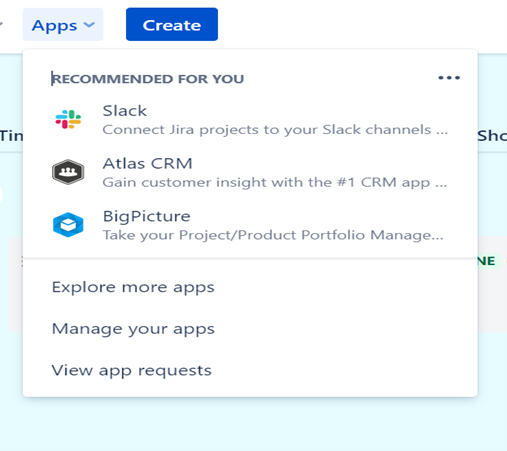

# Getting Started with Jira Software #
ATLASSIAN

Version 1.0

## Overview ##
Jira software is a work management tool that provides a roadmap for the entire team to move forward. This guide helps you to get started with Jira software.

You can use Jira to organize, track, and prioritize business requirements. Jira allows teams to work in an agile environment. You can see the entire life cycle of an issue on your dashboard. You can integrate other tools/apps and invite your team. 

**The following teams can use Jira Software**:

- Agile teams
- Product management teams
- Project management teams
- Documentation teams
- Software development teams
- Dev/Ops teams
- Bug tracking teams
  
**Prerequisites**

- Work/personal email ID
- Good internet connection

**Setting up**

You can install Jira software using any browser. You need personal/work email ID to sign in. 

- Log into your Jira account
- Sign up [here](https://www.atlassian.com/software/jira/free), if you do not have an account already.

## Exploring the User Interface ##

**Create a Project**

After you log into your account, on the top pane **Projects** appears. You can use the drop-down button and select **Create project** to create a new project. Your recent project appears on the top. Select **View all projects** to see all your projects.

**Choose Project templates**

You can start with a blank project or choose a premade template for your project. Choose the one that suits best your team and business requirements.

**Invite People**

Now it’s time to bring your team on board.  On the top pane select **People** to **Invite people** to Jira or **Create a team**. You need to add your team member first to assign an Issue.

**Create an Issue**

Select **Create** on the top pane to go to create issue page. You can create an **Epic**, **Story**, **Bug**, **Task**, or **Subtask** for your project. You can assign the issues to someone and set other priorities as well.

 

**Integrate Other Tools**

Jira allows your team to work on different tools in the same environment. On the top pane select **Apps** to search and integrate apps that you wish to work on.

Check out the User guide to learn more about all these features.

